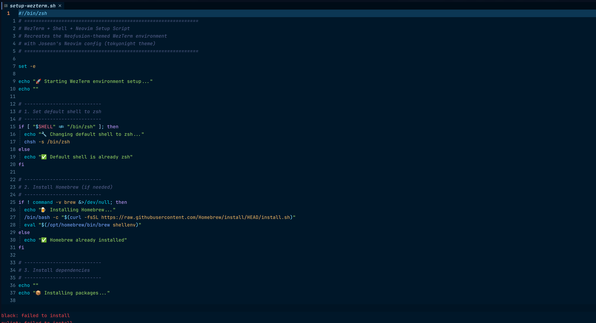
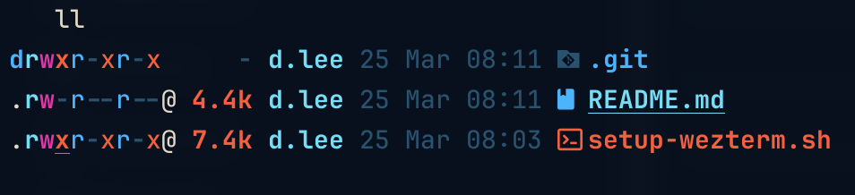
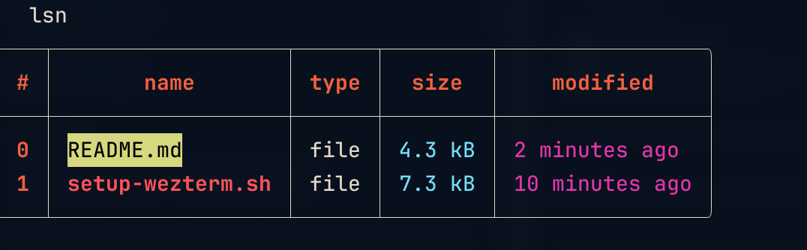

# WezTerm + Neovim Environment Setup

A one-script macOS terminal setup that installs and configures a cohesive, themed development environment using **WezTerm**, **Neovim**, **Starship**, and modern shell tools — all styled around the **Neofusion** color palette.

---

## Preview

### Script open in WezTerm — Neofusion syntax colors



### `ll` — eza with icons and Neofusion color coding



### `lsn` — Nushell structured table output



---

## What Gets Installed

| Tool | Purpose |
|------|---------|
| [WezTerm](https://wezfurlong.org/wezterm/) | GPU-accelerated terminal emulator |
| [Neovim](https://neovim.io/) | Modern Vim with LSP + plugin support |
| [Starship](https://starship.rs/) | Cross-shell prompt (powerline-style) |
| [eza](https://github.com/eza-community/eza) | `ls` replacement with icons and color |
| [fzf](https://github.com/junegunn/fzf) | Fuzzy finder for files and history |
| [Nushell](https://www.nushell.sh/) | Structured-data shell (`lsn` alias) |
| [ripgrep](https://github.com/BurntSushi/ripgrep) | Fast regex search (used by Telescope in nvim) |
| [JetBrainsMono Nerd Font](https://www.nerdfonts.com/) | Patched font with icons for terminal + editor |

---

## Color Scheme — Neofusion

The entire environment uses a consistent **Neofusion** palette:

| Role | Color |
|------|-------|
| Background | `#070f1c` (near-black navy) |
| Foreground | `#e0d9c7` (warm off-white) |
| Accent 1 | `#ea6847` (burnt orange) |
| Accent 2 | `#d943a8` (magenta/pink) |
| Accent 3 | `#5db2f8` (sky blue) |
| Accent 4 | `#86dbf5` (cyan) |
| Muted | `#2f516c` (slate blue) |

The Starship prompt uses these as powerline segment colors. WezTerm maps them to ANSI slots for consistent syntax highlighting across any CLI tool.

---

## Setup

### Prerequisites

- macOS (Apple Silicon or Intel)
- WezTerm installed — [download here](https://wezfurlong.org/wezterm/installation.html)

### Run

```bash
chmod +x setup-wezterm.sh
./setup-wezterm.sh
```

The script is idempotent — safe to re-run. It skips anything already installed.

### After Running

1. **Restart WezTerm** to pick up the new config and font.
2. Run `nvim` — `lazy.nvim` will auto-install all plugins on first launch.
3. Press `U` to update plugins, then `q` to close the plugin manager.

---

## What Gets Configured

### `~/.zshrc`

- Starship prompt initialization
- `fzf` key bindings and tab completion
- `eza` aliases: `ls`, `ll`, `la`, `lt` (tree view)
- `lsn` alias: Nushell table-format `ls`

### `~/.config/starship.toml`

Powerline-style prompt with three segments:
- **Directory** — current path (slate blue background)
- **Git branch + status** — branch name and dirty indicators (orange background)
- **Package version** — shown when in a project with a manifest (magenta background)

Plus right-aligned command duration and exit status indicators.

### `~/.wezterm.lua`

- Neofusion color scheme applied to all 16 ANSI color slots
- JetBrainsMono Nerd Font, size 14, line height 1.2
- 16px window padding on all sides
- Borderless window (`RESIZE` decorations)
- 95% background opacity with macOS blur (20px)
- Fancy tab bar with Neofusion tab colors

### `~/.config/nvim/`

Installs [Josean Martinez's dev-environment-files](https://github.com/josean-dev/dev-environment-files) Neovim config, which includes:

- **lazy.nvim** plugin manager
- **tokyonight** colorscheme
- **nvim-tree** file explorer
- **Telescope** fuzzy finder (backed by ripgrep)
- **LSP** setup via `mason.nvim`
- **Treesitter** syntax highlighting
- **lualine** statusline

> Any existing `~/.config/nvim` is backed up automatically before install.

---

## Credits

- Neofusion theme concept — [diegoulloao/neofusion.nvim](https://github.com/diegoulloao/neofusion.nvim)
- Neovim config — [josean-dev/dev-environment-files](https://github.com/josean-dev/dev-environment-files)
